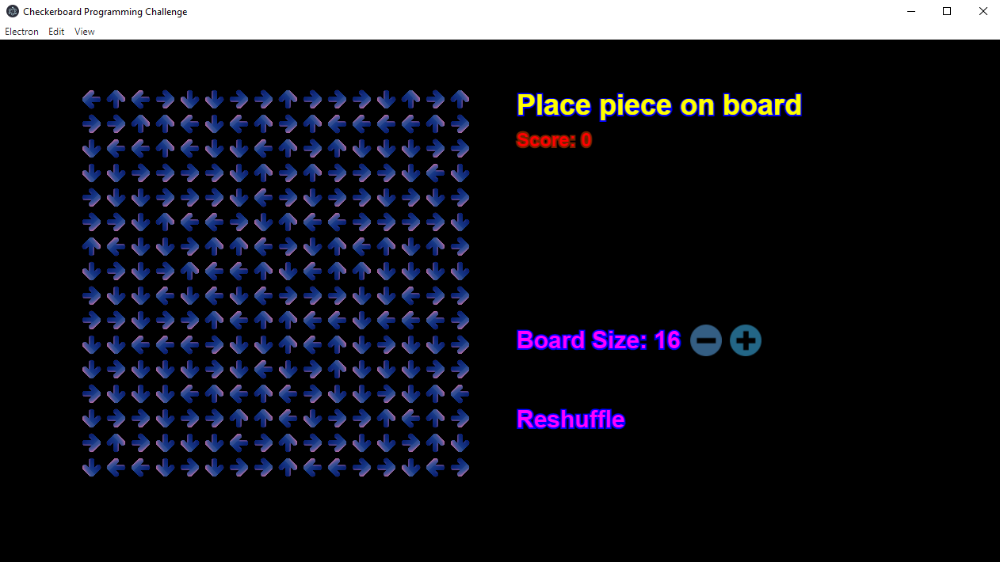
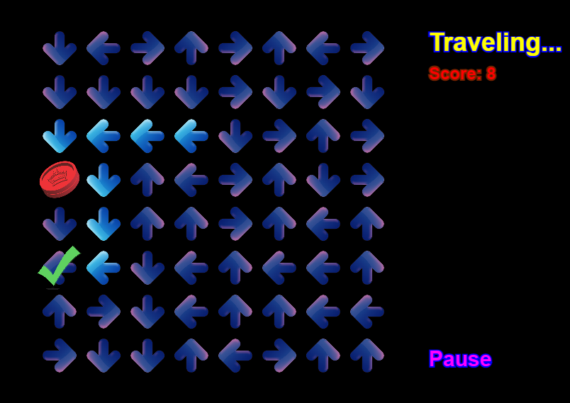

# Top Level Notes

## About


This was a coding challenge I completed as part of my interview process for a previous employer. The company has since ceased to exist, so I doubt anyone will mind if I publish my code here.

I wrote this code in TypeScript (as superset of JavaScript, as described below). I had had only the most minimal experience with Javascript prior to working on this challenge, so this is an example of code I wrote in a language I didn't even know at all two days before. If you've coded in a number of other languages, JavaScript is not hard to pick up.

## The Challenge


Text copied from below:

*Consider a checkerboard of unknown size. On each square is an arrow that randomly points either up, down,
left, or right. A checker is placed on a random square. Each turn the checker moves one square in the direction
of the arrow. Visualize an algorithm that determines if the checker moves off the edge of the board or ends up in a cycle.*

  - *Include UI controls to play, stop, and reset the game.*
  - *Include UI controls to change the size of the board and to shuffle the arrows.*
  - *Include audio to make things more interesting.*
  - *Add some style to make it look good.*
  - *Write the algorithm in constant memory space. The brute force solution is O(n) memory space.*

*This challenge is meant to show off code organization, quality, and cleanliness, design patterns, and the ability to learn new languages
and ecosystems. Have fun with it.*

## My implementation


Nothing too special to say. I relied on my experience as a game developer and added some animation and sound effects. My solution, of course, is object-oriented.

Starting state of the game:



Game in progress (shown with a smaller grid):



## Installation


Follow the instructions that come after ***Original README*** below. They still work in December, 2020.

However, you might also add the additional two steps, if things don't work initially:
```
npm install electron -g
npm install pixi.js
```

---------------------------------------------------------------------------------------------------

# Original README

## Prereqs

Install [Node.js 4.5.0](https://nodejs.org/en/). This will also install `npm` as a global command.

## Installing

Run the command `npm install` to install all dependencies.

## Building

| Command | Description
|---|---|
|`npm run build` | Build the project in debug mode. |
|`npm run watch` | Watches files and will build every time a file is changed. Use this for development |
|`npm run clean` | Deletes built JavaScript files. |

## Executing

Run the command `electron main.js` to run the project.

## The Challenge

Consider a checkerboard of unknown size. On each square is an arrow that randomly points either up, down,
left, or right. A checker is placed on a random square. Each turn the checker moves one square in the direction
of the arrow. Visualize an algorithm that determines if the checker moves off the edge of the board or ends up in a cycle.

  - Include UI controls to play, stop, and reset the game.
  - Include UI controls to change the size of the board and to shuffle the arrows.
  - Include audio to make things more interesting.
  - Add some style to make it look good.
  - Write the algorithm in constant memory space. The brute force solution is O(n) memory space.

This challenge is meant to show off code organization, quality, and cleanliness, design patterns, and the ability to learn new languages
and ecosystems. Have fun with it.

## Some important notes

This project is bootstrapped to transpile TypeScript into JavaScript. TypeScript is very much like C# or ActionScript. It is a superset of JavaScript. This means that all JavaScript is valid TypeScript. Feel free to code this in vanilla ES6 JavaScript, but having type information is very helpful especially coming from a C++/Java/C# background.

To take advantage of TypeScript's strong types and an IDE's helpful autocomplete, install the Atom Editor and install the `atom-typescript` package.

Globally install `typings`. To do this, run the command `npm install typings -g`. `typings` allows you to install type information
about external npm modules. For example, if you were to use the
external module `async`, you would `npm install async`, and the run `typings search async`. It will display the name and the source.
To install the typings (which will be put in the `typings` folder of this project) run `typings install dt~async --global`. Then the TypeScript compiler will know how to compile against the async module.

The entry point to the application is `index.html`, which in turn points immediately to `index.js`. The typescript files in `src`
are all transpiled and browserified into a single JavaScript file at the root of the project, which is `index.js`. Do not modify this file as it is auto generated. Also do not modify `main.js`, which is just a bootstrap to get electron running.

Use whatever libraries you want from the npm public repository. You can find them [here](https://www.npmjs.com/) and install them with `npm install cool-lib-i-found --save`.

Included is a minimal setup for [Pixi.js](https://github.com/pixijs/pixi.js), a 2D scene graph library that's GPU accelerated. If you've ever programmed ActionScript, it should look *very* familiar. The documentation can be found [here](https://pixijs.github.io/docs/index.html). Please use Pixi.js for all visualizations, UI, and interactions.

To debug the application goto `View -> Toggle DevTools`. This will bring up the DevTools debugger. This is the standard DevTools that comes with Chrome.
